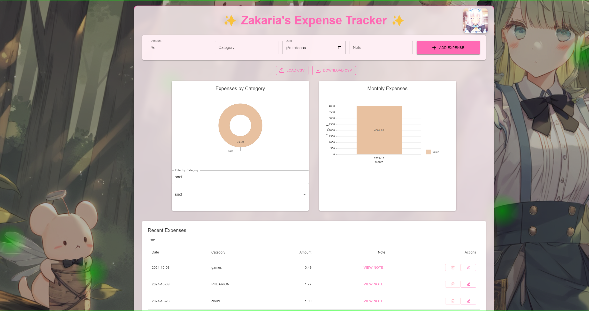

# 💖 Waifu Expense Tracker ✨



## 🌸 About

Welcome to the most adorable expense tracking app ever! This kawaii-themed application helps you manage your finances with style and cuteness~ 

## ✨ Features

- 🎀 Beautiful kawaii interface with animated elements
- 📊 Cute visualizations of your expenses
- 🌈 Category-based expense tracking
- 💝 Note-taking capability with kawaii GIF animations
- 📱 Responsive design for all devices (but computer/tablet recommended)
- 💖 Customizable categories
- 🌟 Interactive charts and graphs
- 🎉 Import/Export functionality

## 🚀 Getting Started

### Prerequisites
```bash
npm install
```

### Running the App
```bash
npm run dev
```

Open [http://localhost:3000](http://localhost:3000) with your browser to see the kawaii magic~ ✨

## 🛠️ Built With

- 💜 Next.js
- 💙 React
- 💚 Material-UI
- 💛 Nivo Charts
- 💗 Emotion

## 🌈 Usage

1. 📝 Enter your expense details
2. 🎨 Choose a category
3. 📅 Select the date
4. ✨ Add optional notes
5. 🌟 Watch your expenses come to life in cute charts!

## 🎨 Customization

You can customize the theme by modifying the colors in `providers.tsx`:

```typescript
const theme = createTheme({
    palette: {
        primary: {
            main: '#FF69B4', // Pink!
        },
        secondary: {
            main: '#FFB6C1', // Light pink!
        },
    },
});
```

## ⭐ Star History

If you enjoy this kawaii expense tracker, please give it a star! ⭐

## 📫 Contact

Project Link: [https://github.com/PhantHive/expense-tracker](https://github.com/PhantHive/expense-tracker)

## 💝 Acknowledgments

- 🎀 Special thanks to the open-source community
- ✨ Inspired by cute Japanese design

---

<div align="center">
Made with 💖 and lots of ✨sparkles✨
</div>